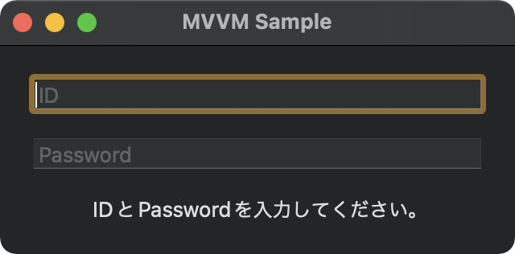
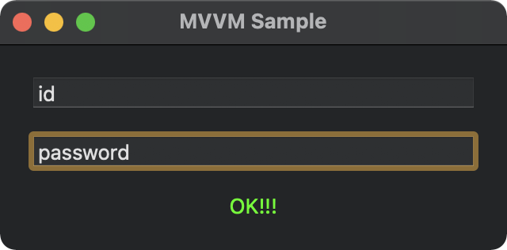

# MVVM-Sample-Combine-AppKit

MVVM の練習に Combine と AppKit でシンプルなサンプルを作ってみたものです。<br/>
[iOS アプリ設計パターン入門の MVVM サンプル](https://github.com/peaks-cc/iOS_architecture_samplecode/tree/master/07)と同様のものを Combine で再現しています。

```plain:構造
┬─ Model
│   ├─ AppDelegate
│   ├─ SampleModel (SampleModelProtocol)
│   └─ SampleModelError
│
├─ ViewModel
│   ├─ SampleViewModel
│   └─ Extension+SampleModelError
│
└─ View
    ├─ Main.storyboard
    └─ SampleViewController
```

## スクリーンショット





## テスト

- UnitTest
  - SampleModelTests
  - SampleViewModelTests
- UITest
  - MVVMSampleUITests
